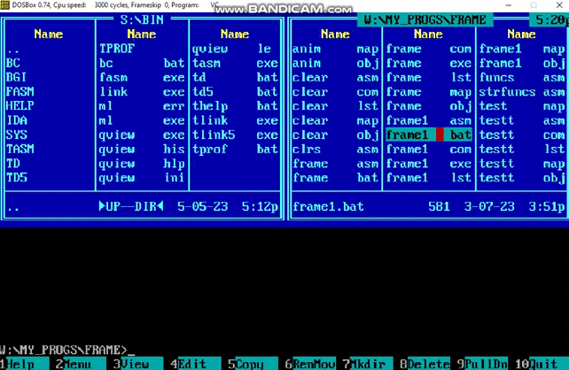

# Frame

 Program that draws modifiable frame with message in MS DOS.

## To get started

  Compile and run ``./FRAME1.ASM`` in the root directory of this project in MS DOS.

## Input

  Arguments of cmdline:
  - type of frame
  - hex colour of frame
  - hex colour of filling
  - hex color of text
  - text

## Control

  There are 4 keys for controlling frame actions:
  - <←> - move left
  - <→> - move right
  - <↓> - move down
  - <↑> - move up
  - <+> - increase size
  - <-> - decrease size

## Example of work

  
